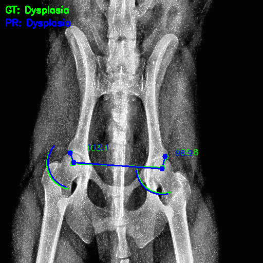

# 🐕 Hip Dysplasia Detection in Dogs

This repository documents my pipeline for detecting **Canine Hip Dysplasia (CHD)** from pelvic X‑rays.  
It combines **YOLOv8** for automatic hip region cropping and a **MobileNet CNN** for first Keypoint Detection and then classification based on calculated Norberg angles and image features.

---

## 📌 Overview

Early detection of CHD is crucial for veterinary care and breeding decisions.  
This project:
- Uses **YOLOv8** exclusively as a cropping tool for hip ROI extraction
- Applies preprocessing to improve anatomical clarity in X‑rays
- Manually annotates 4 key anatomical landmarks with CVAT
- Computes **Norberg angles** biomechanically from landmarks
- Classifies X‑rays as **Normal** or **Dysplasia** using a **MobileNet-based CNN**
- Achieves strong sensitivity on a limited dataset

⚠️ **Note:**  
This repository is intended for **demonstration and reproducibility of methodology** — dataset and model weights are **not included** due to licensing and size limits.

---

## 📂 Repository Structure
├── notebooks/ # Jupyter notebooks for pipeline stages

├── outputs/ # Sample evaluation results (small images)

│ ├── metrics_barplot.png

│ ├── confusion_matrix.png

│ ├── angle_dist_L.png

│ ├── angle_dist_R.png

│ └── 10_hip0_annot.png

├── requirements.txt # Library dependencies

├── .gitignore

└── README.md

---

## 📊 Performance
**RMSE (Keypoint Localization):** 3.21 px  
**Accuracy:** 76%  
**Sensitivity:** 86%  
**Specificity:** 54%

**Metrics Visualization:**  
  

**Confusion Matrix:**  
  

---

##  Angle Distributions
**Norberg Angle — Left Hip:**  
  

**Norberg Angle — Right Hip:**  
  

---

##  Example Prediction
*GT = Ground Truth, PR = Prediction*  


---

##  Methods Summary
1. **Detection & Cropping:**
   - YOLOv8m trained on hip joints — enforces **one hip ROI per image**
   - Square crop with padding, resized to 512×512 px  
   
2. **Preprocessing:**
   - CLAHE (local contrast)
   - Unsharp masking
   - Laplacian sharpening for edge enhancement

3. **Annotation:**
   - Four key points:  
     - Left & Right Femoral Head Centers (L_FHC / R_FHC)  
     - Left & Right Cranial Acetabular Rims (L_CAR / R_CAR)

4. **Angle Calculation:**
   - Norberg angles measured using annotated points  
   - Threshold at 105° (per veterinary standard)

5. **Keypoint Detection and Classification:**
   - MobileNet CNN trained on processed hip images + angle information
   - Two-class output: **Normal** or **Dysplasia**

---

##  Requirements
Install Python dependencies:
```bash
pip install -r requirements.txt
```
---

##  Citation
If this work contributes to your research, please cite:
@article{afshar2025chd,
  title={Hip Dysplasia Detection in Dogs using YOLOv8 Preprocessing and MobileNet CNN},
  author={Afshar, Arian},
  year={2025}
}

---

##  Author
Arian Afshar
Biomedical Engineering @ Amirkabir University of Technology
AI Researcher in Neuroscience & Medicine (IPM)
This work was done as a freelancing project


